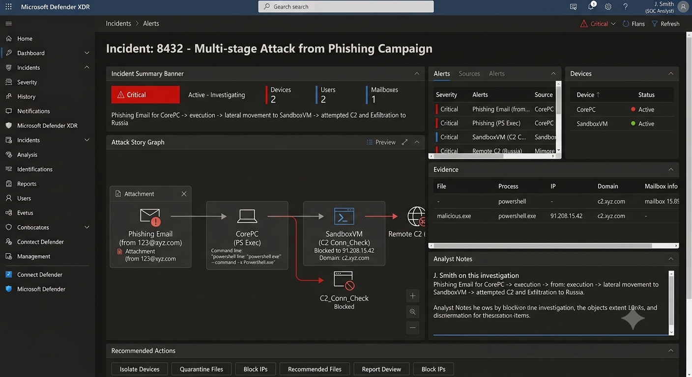

# 🛡️ Lab 3 – Microsoft Defender XDR Investigation

## Objective

Investigate security incidents using Microsoft Defender XDR by analyzing alerts, incidents, device timelines, process trees, file details, and network activity.

## Environment

- Microsoft Defender XDR Learning Lab

## Tasks Completed

- Reviewed incident summaries
- Investigated security alerts
- Explored the Device Timeline
- Analyzed process trees
- Reviewed file details and reputation
- Investigated network connections
- Performed a simulated incident investigation

## Investigation Scenario

Investigated a suspicious PowerShell execution by identifying the affected device, user, parent process, command-line arguments, associated network connections, and recommended containment actions.

## Skills Demonstrated

- Microsoft Defender XDR
- Incident Investigation
- Alert Triage
- Process Tree Analysis
- Endpoint Investigation
- File Reputation Analysis
- Network Analysis
- Incident Documentation

## Key Takeaway

Microsoft Defender XDR centralizes endpoint telemetry, alerts, and investigation tools, allowing analysts to efficiently understand suspicious activity, determine impact, and support incident response.

## Screenshots

- Incident Dashboard
 
- Incident Summary
- 
- Device Timeline
- 
- Process Tree
- 
- File Details
- 
- Network Activity
- 
