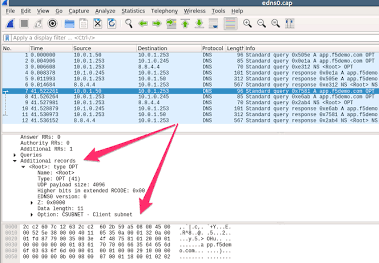

# 🛡️ Lab 5 – Wireshark Network Traffic Investigation

## Objective

Capture and analyze network traffic using Wireshark to investigate DNS, TCP, ICMP, HTTP, and HTTPS activity commonly encountered during SOC investigations.

## Environment

- Windows 11
- Wireshark

## Tasks Completed

- Captured live network traffic
- Generated DNS, HTTP, HTTPS, and ICMP traffic
- Analyzed DNS queries and responses
- Reviewed TCP three-way handshakes
- Followed TCP streams
- Investigated external network connections
- Saved the packet capture for future analysis

## Protocols Investigated

| Protocol | Purpose |
|----------|---------|
|DNS|Domain name resolution|
|TCP|Reliable transport protocol|
|TLS|Encrypted web communication|
|HTTP|Web requests|
|ICMP|Network diagnostics|

## Investigation Scenario

Investigated a simulated report of suspicious internet activity by reviewing DNS requests, identifying external IP addresses, analyzing TCP connections, and documenting observed protocols.

## Skills Demonstrated

- Wireshark
- Packet Analysis
- DNS Investigation
- TCP Analysis
- Network Traffic Investigation
- Network Forensics
- Incident Documentation

## Key Takeaway

Wireshark provides detailed visibility into network communications, allowing analysts to identify connections, troubleshoot issues, and investigate suspicious activity at the packet level.

## Screenshots

### DNS Traffic

- TCP Handshake
- TLS Traffic
- ICMP Packets
- TCP Stream
- Packet Details
