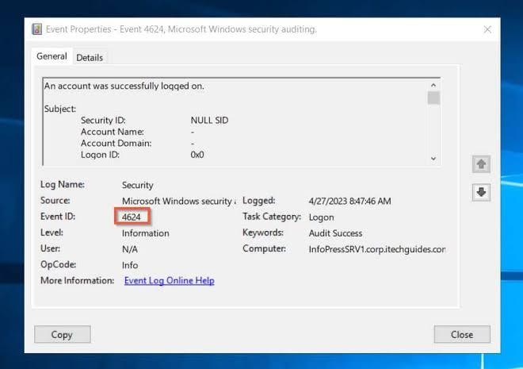
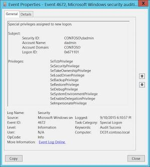
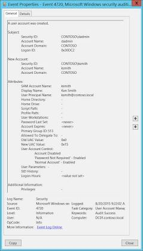
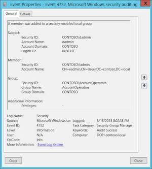

# 🛡️ Lab 6 – Active Directory Investigation

## Objective

Investigate authentication events, user account activity, and privileged group changes commonly encountered in Active Directory environments.

## Environment

- Microsoft Sentinel / Microsoft Defender XDR Learning Lab (or equivalent)
- Windows Event Logs

## Tasks Completed

- Reviewed successful and failed authentication events
- Investigated privileged logons
- Reviewed user account creation events
- Analyzed privileged group membership changes
- Investigated password-related events
- Performed a simulated Active Directory investigation

## Event IDs Investigated

| Event ID | Description |
|----------|-------------|
|4624|Successful logon|
|4625|Failed logon|
|4672|Special privileges assigned|
|4720|User account created|
|4723|Password change attempt|
|4724|Password reset|
|4732|User added to privileged group|

## Investigation Scenario

Investigated a report of unexpected administrative privileges by reviewing authentication logs, privileged group membership changes, and related account activity to determine whether unauthorized privilege escalation occurred.

## Skills Demonstrated

- Active Directory Investigation
- Authentication Analysis
- Identity Security
- Privilege Escalation Detection
- Windows Event Analysis
- Incident Documentation

## Key Takeaway

Identity-based attacks often target user accounts and administrative privileges. Monitoring authentication events and privileged group changes is essential for detecting unauthorized access and privilege escalation in enterprise environments.

## Screenshots

### Successful Logon (4624)

### Special Privileges Assigned (4672)

### User Account Created (4720)

### Group Membership Change (4732)

