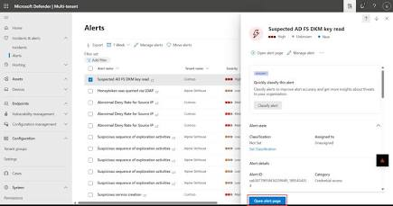
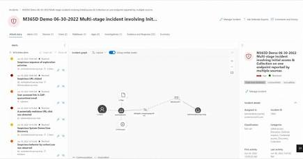
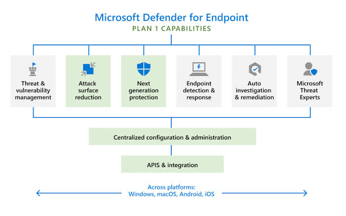
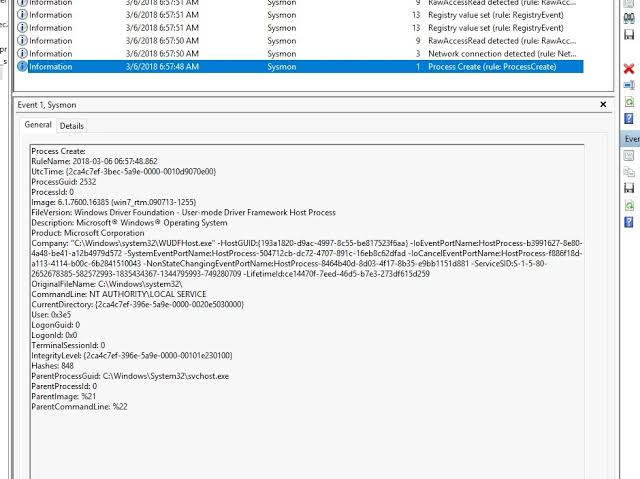
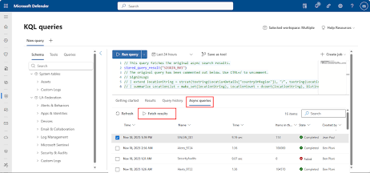
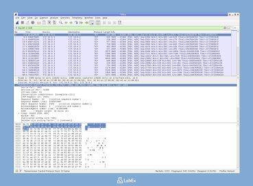
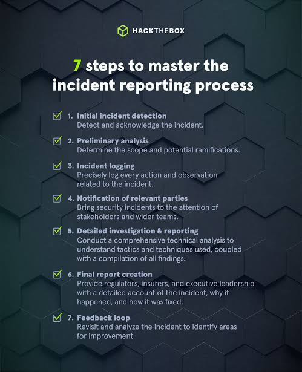

# 🛡️ Lab 10 – Full Enterprise SOC Incident Investigation

## Objective

Conduct a complete enterprise-style SOC investigation by analyzing an endpoint alert, reviewing endpoint telemetry, performing threat hunting, examining persistence mechanisms, and documenting findings in a structured incident report.

## Environment

- Microsoft Defender XDR
- Microsoft Sentinel
- Windows Event Logs
- Sysmon
- Wireshark
- Kusto Query Language (KQL)

## Tasks Completed

- Reviewed a high-severity alert
- Investigated the related incident
- Analyzed the device timeline
- Reviewed process trees
- Investigated Sysmon events
- Executed KQL hunting queries
- Reviewed authentication events
- Checked persistence mechanisms
- Investigated network activity
- Built an incident timeline
- Produced a final incident report

## Investigation Summary

Performed an end-to-end investigation of a simulated suspicious PowerShell execution. Correlated endpoint telemetry, authentication events, process activity, and network connections to determine the scope of the incident and recommend appropriate response actions.

## Skills Demonstrated

- Incident Response
- Microsoft Defender XDR
- Microsoft Sentinel
- KQL Threat Hunting
- Windows Event Analysis
- Sysmon Investigation
- Network Investigation
- Timeline Analysis
- IOC Analysis
- MITRE ATT&CK Mapping
- Technical Reporting

## Key Takeaway

Effective SOC investigations require correlating evidence from multiple security tools, validating findings, assessing impact, and documenting results clearly to support containment, recovery, and future detection improvements.

## Screenshots

### Defender Alert

### Incident Overview

### Device Timeline

### Process Tree

### Sysmon Events

### KQL Results

### Network Investigation

### Final Incident Report

